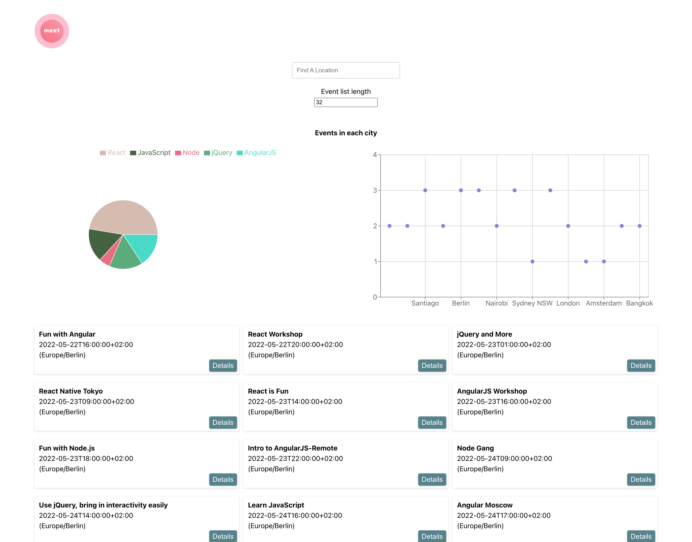

# meet

An application for users to find upcoming events.

## Table of contents

- [Overview](#overview)
  - [Screenshot](#screenshot)
  - [Links](#links)
  - [Built with](#built-with)
  - [What I learned](#what-i-learned)
  - [Continued development](#continued-development)
- [Author](#author)
- [User Stories](#user-stories)

## Overview

Meet is for finding upcoming events in a specific city. It is a progressive web app with the ability to work offline and a serverless backend developed using a TDD technique.

### What it does

Users are able to:

- Filter events by city.
- Show/hide event details.
- Specify number of events.
- Use the app when offline
- Add an app shorcut to the home screen.
- View a chart showing the number of upcoming events by city.

### Screenshots

### Links

- Live Site URL: [Here](https://curtisgry.github.io/meet/)

### Built with

- React
- Jest and Puppeteer for testing
- CSS

### What I learned

I learned how test driven development is used to make code with lest bugs and errors. 

## Author

- Website - [Curtis Gray](https://curtisgry.github.io/portfolio-website/)

## User Stories

### Show/Hide an events details.

As a user,
I should be able to click on an event
So that I will be able to view or hide details about that event.

- #### An event element is collapsed by default

Given a user is viewing a list of events.

When the list loads on the page.

Then the element will be collapsed in the list.

- #### User can expand an event to see its details

Given a user wants more info on an event.

When the event is clicked.

Then the element will expand to show more details.

- #### User can collapse an event to hide its details

Given a user is finished viewing event details.

When the arrow icon on the event is clicked

Then the element will be collapsed in the list.

---

### Specify number of events.

As a user,
I should be able to specify a number,
So that I can choose how many events will be displayed to me.

- #### When user hasn't specified a number, 32 is the default number

Given a user hasnt selected a number of events

When the list loads on the page.

Then the list will have at most 32 items populated.

- #### User can change the number of events they want to see

Given a user wants to change the number of events

When the user specifies a number of events.

Then the number selected will determine the maximum events to be populated.

---

- ### Use the app when offline

As a user, 
I should be able to be offline,
So that I can still see the information for the settings I had previously used without internet.

- #### Show cached data when there's no internet connection

Given a user has no internet connection

When the page loads.

Then they should be able to see data available from when previously connected.

- #### Show error when user changes the settings(city, time range)

Given a user has no internet connection

When the user changes the settings

Then an error should be displayed due to the connection not being available.

---

### Data visualization

As a user,
I should be able to see a chart,
So that I can have a quick view of how many events are in a city.

- #### Show a chart with the number of upcoming events in each city

Given a user wants an overview of the number of events in a city.

When the user has selected a city.

Then a chart will be displayed showing the number of events.